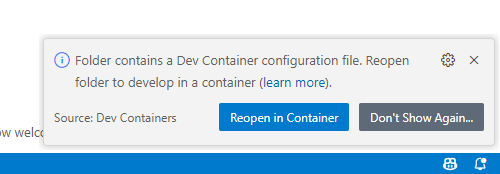
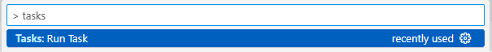
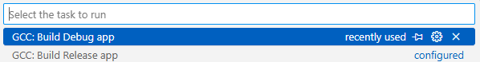
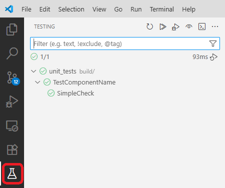

# MandelbrotFractal <!-- omit in toc -->

- [Назначение проекта](#назначение-проекта)
- [Возможности](#возможности)
- [Скриншоты](#скриншоты)
- [Начало работы](#начало-работы)
- [Сборка проекта](#сборка-проекта)
  - [Команды для сборки проекта](#команды-для-сборки-проекта)
- [Запуск приложения](#запуск-приложения)
- [Тестирование](#тестирование)
  - [Юнит-тесты](#юнит-тесты)
  - [Проверка с AddressSanitizer](#проверка-с-addresssanitizer)
- [Структура проекта](#структура-проекта)
- [Известные ограничения](#известные-ограничения)

## Назначение проекта

MandelbrotFractal - приложение для рендеринга множества Мандельброта в реальном времени.
Проект построен на C++23, SFML и stdexec, с поддержкой многопоточного вычисления фрактала и интерактивного управления отображением.

## Возможности

- Интерактивная навигация по фракталу:
  - ЛКМ - приближение.
  - ПКМ - отдаление.
  - X - переключение авто-зума (бесконечное приближение к точке Seahorse Valley).
  - C - сброс к исходному виду.
- Рендеринг через SFML в отдельном потоке.
- Вычисление фрактала в пуле потоков с использованием sender/receiver-пайплайна.
- Ограничение FPS для стабильного отображения.

## Скриншоты

### Запуск в контейнере



### Сборка через задачи VS Code





### Запуск тестов в VS Code



## Начало работы

Перед запуском приложения убедитесь, что на хост-машине запущен X11-сервер и он доступен из Dev Container. Без этого окно SFML не будет отображаться.

1. Откройте проект в VS Code.
2. Запустите Dev Container (команда Dev Containers: Reopen in Container).
3. Убедитесь, что Conan-профиль создан:

```bash
conan profile detect || true
```

## Сборка проекта

Для проекта используется Conan + CMake.

### Команды для сборки проекта

Вариант 1 (через задачи VS Code):

- GCC: Build Debug
- GCC: Build Release

Вариант 2 (вручную):

```bash
mkdir -p build
cd build
conan build -b missing -s build_type=Debug ..
```

## Запуск приложения

После успешной сборки:

```bash
./build/MandelbrotFractal
```

## Тестирование

### Юнит-тесты

```bash
./build/MandelbrotFractal_tests
```

или:

```bash
ctest --test-dir build --output-on-failure
```

### Проверка с AddressSanitizer

В репозитории есть скрипт для ASan-проверки:

```bash
./check_asan.sh
```

Скрипт:

- собирает ASan-вариант в build-asan;
- запускает приложение с ASan/LSan;
- пишет отчет в ASAN_report.txt.

## Структура проекта

- include/ - заголовочные файлы.
- src/ - исходный код приложения.
- tests/ - модульные тесты (GoogleTest).
- build/ - артефакты основной сборки.
- build-asan/ - артефакты ASan-сборки.
- check_asan.sh - сценарий проверки AddressSanitizer.

## Известные ограничения

- В Linux-контейнере для графического окна SFML требуется корректно настроенный X11 forwarding (переменная DISPLAY и доступ к host-gateway).
- При ASan-проверках в контейнере возможны утечки во внешнем графическом стеке (X11/GLX/SFML). Для этого используется файл подавлений asan.supp.
